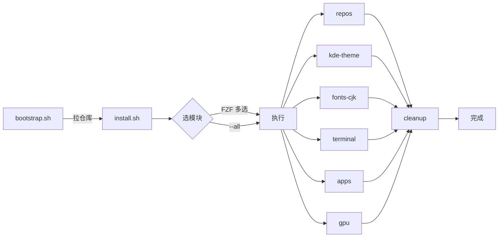

<div align="center">

# 🌸 xynrin-fedora

**Fedora KDE 一键美化 · 中文友好 · 模块化**

刚装完 Fedora KDE Spin？一条命令把它变成好看、好用、带中文输入法和常用软件。

[](https://github.com/Xynrin/xynrin-fedora/actions/workflows/ci.yml)


[一键安装](#-一键安装) · [模块清单](#-模块清单) · [日常命令](#-日常命令) · [常见问题](#-常见问题) · [自定义](#-自定义)

</div>

---

## ✨ 一键安装

```bash
bash <(curl -fsSL https://raw.githubusercontent.com/Xynrin/xynrin-fedora/main/bootstrap.sh)
```

> [!IMPORTANT]
> 请用**普通用户**运行（不要 `sudo bash …`），脚本内部会按需申请一次 sudo 密码。
> 这样 `~/.config` 才会落到你自己家里，不会污染 root。

15 分钟内搞定。流程大致这样：



---

## 📦 模块清单

| 模块 | 默认 | 做什么 |
|------|:---:|------|
| **`repos`** | ✅ 必跑 | 启用 RPM Fusion free / nonfree + Flathub |
| **`kde-theme`** | ✅ | Breeze Dark + Papirus 图标 + Fedora 壁纸 + GTK 跟随深色 |
| **`fonts-cjk`** | ✅ | Noto CJK + JetBrains Mono + fcitx5 拼音 |
| **`terminal`** | ✅ | fish + starship + eza/bat/zoxide/fzf/fastfetch；conf.d/functions 标准布局 |
| **`apps`** | ✅ | 浏览器 / 音视频 / 办公 / 通讯（dnf + flatpak），fzf 多选 |
| **`gpu`** | ✅ | 显卡驱动（NVIDIA akmod / AMD mesa-freeworld / Intel VAAPI） |
| **`cleanup`** | ✅ 兜底 | 隐藏开发工具 `.desktop` 图标，桌面投放使用说明 |

---

## 🛠️ 日常命令

装在 `~/.local/bin/`，fish 和 bash 都能直接调。完整速查跑 **`xf-help`**（fzf TUI）。

| 命令 | 一句话 |
|------|------|
| **`xf-help`** | fzf 命令速查 TUI，左列表 / 右说明，Enter 直接运行 |
| **`xf-self-update`** | 拉最新仓库重部署 dotfiles，**升级首选** |
| **`xf-update`** | 一把梭：dnf + flatpak + fwupdmgr |
| **`xf-clean`** | autoremove + journal vacuum + flatpak unused |
| **`xf-info`** | 系统状态摘要（贴 issue 时直接复制） |
| **`xf-theme dark\|light`** | 命令行切 KDE + GTK 主题 |

详细说明：[`docs/COMMANDS.md`](docs/COMMANDS.md) 或装好后 `xf-help`。

---

## 🚀 install.sh 命令参考

```bash
./install.sh                   # 弹 FZF 菜单（默认全选）
./install.sh --all             # 跳菜单，全装，所有 confirm 走默认值
./install.sh --only apps       # 只装某个模块（逗号分隔可多个）
./install.sh --only kde-theme,fonts-cjk
./install.sh --dry-run         # 只预览，不真动
```

**环境变量**

| 变量 | 默认 | 作用 |
|---|---|---|
| `XF_DOTFILES_FORCE` | `1` | dotfiles 强刷 + 备份；设 `0` 保留宿主机已有配置 |
| `XF_BACKUP_DIR` | `~/.config/.xynrin-backup` | 备份目录 |
| `XF_SKIP_CN_MIRROR` | `0` | 设 `1` 跳过 TUNA 镜像切换（境外用户） |
| `XF_NONINTERACTIVE` | `0` | `--all` 自动设 `1`，跳过所有 confirm |

---

## ✅ 系统要求

- **Fedora 41+**（已在 Fedora 44 KDE Spin 测试，Plasma 6.6 + dnf5）
- 其他 Spin 也能跑，KDE 模块对非 KDE 桌面会跳过
- 能访问外网（脚本从 github / flathub / rpmfusion 拉资源）
- **普通用户**（UID ≥ 1000），不能用 root 直接跑
- x86_64 或 aarch64

---

## ❓ 常见问题

<details>
<summary><b>注销重登后输入法没反应？</b></summary>

```bash
pgrep -u $USER fcitx5 || setsid fcitx5 -d &
```

不行就：系统设置 → 自启动 → 添加 `fcitx5`，再重启一次。
</details>

<details>
<summary><b>fish 装上但没颜色？</b></summary>

99% 是 starship 调色板没生效。检查：

```bash
head ~/.config/starship.toml
```

`palette = "catppuccin"` 必须在**顶层**（不能在任何 `[xxx]` 表内）。如果不对：

```bash
xf-self-update
```

会强刷正确的配置（旧文件备份在 `~/.config/.xynrin-backup/`）。
</details>

<details>
<summary><b>KDE 主题没换？</b></summary>

```bash
xf-theme dark
setsid plasmashell --replace &
```

第二条是后台重启 plasmashell（不会注销当前会话），让面板/小组件吃到新主题。
</details>

<details>
<summary><b>默认 shell 换 fish 后想换回 bash？</b></summary>

```bash
chsh -s /bin/bash
```
</details>

<details>
<summary><b>装失败的软件在哪看？</b></summary>

```
~/Documents/xynrin-fedora-install-failed.txt
```

带前缀（`dnf:` / `flatpak:`）。可以手动重试。
</details>

<details>
<summary><b>安装日志？</b></summary>

```
/tmp/xynrin-fedora-install.log
```

或跑 `xf-info` 看末尾摘要。
</details>

<details>
<summary><b>想回滚 dotfiles？</b></summary>

```bash
ls ~/.config/.xynrin-backup/
# 找到时间戳，例如 20260521-093045
cp -a ~/.config/.xynrin-backup/<file>.20260521-093045.bak ~/.config/<file>
```

KDE 备份打包成 tar.gz：

```bash
tar -xzf ~/.config/.xynrin-backup/plasma-20260521-093045.tar.gz -C ~/.config/
```
</details>

---

## 🎨 自定义

| 想改 | 改哪里 |
|---|---|
| 加/减软件 | `applist-kde.txt` / `applist-common.txt`（行尾 `# 注释` 是 fzf 预览） |
| fish 别名 / 缩写 / 环境变量 | `kde-dotfiles/.config/fish/conf.d/*.fish` |
| 加 fish 自定义函数 | `kde-dotfiles/.config/fish/functions/<name>.fish`（按需加载） |
| starship 提示符 | `kde-dotfiles/.config/starship.toml` |
| 加 `xf-*` 工具 | `kde-dotfiles/.local/bin/<name>`，部署时自动 chmod +x |
| 加新模块 | `scripts/NN-xxx.sh` + `install.sh` 的 `MODULES` 数组加一行 |
| 命令文档 / `xf-help` 内容 | `docs/COMMANDS.md`（每个 `## xxx` 是一条命令） |

---

## 📁 仓库结构

```
xynrin-fedora/
├── install.sh                    # 主入口：FZF 菜单 + 步骤进度
├── bootstrap.sh                  # 在线引导：拉仓库 → install.sh
├── VERSION                       # 版本号（xf-help / self-update 用）
├── applist-{common,kde}.txt      # 软件清单（FZF 多选数据源）
├── docs/
│   └── COMMANDS.md               # 命令速查（xf-help 数据源）
├── scripts/
│   ├── 00-utils.sh               # 公共工具：UI / dnf_install / deploy_tree
│   ├── 10-repos.sh               # RPM Fusion + Flathub
│   ├── 15-cn-mirror.sh           # 自动切 TUNA（仅 CN 时区）
│   ├── 20-kde-theme.sh           # KDE Plasma 美化
│   ├── 30-fonts-cjk.sh           # 中文字体 + fcitx5
│   ├── 40-terminal.sh            # fish + starship + xf-* 部署
│   ├── 50-apps.sh                # FZF 多选装软件
│   ├── 60-gpu.sh                 # 显卡驱动
│   └── 90-cleanup.sh             # 收尾
└── kde-dotfiles/
    ├── .config/
    │   ├── fish/                 # fish 配置（conf.d/ + functions/）
    │   ├── starship.toml
    │   ├── fastfetch/config.jsonc
    │   ├── fcitx5/{config,profile}
    │   └── fontconfig/fonts.conf
    └── .local/bin/               # xf-* 工具（部署到 ~/.local/bin）
        ├── xf-help
        ├── xf-self-update
        ├── xf-update
        ├── xf-clean
        ├── xf-info
        └── xf-theme
```

---

## 📜 License

[MIT](LICENSE)

<div align="center">

如果对你有用，给个 ⭐ 鼓励一下

</div>
