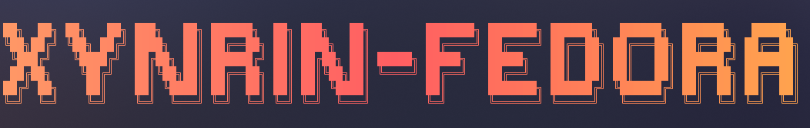
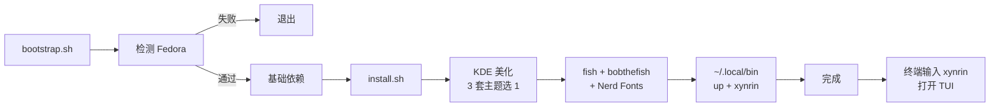

<div align="center">


**🌸 一条命令让 Fedora 44 KDE 变得好看、好用、带中文输入法 🌸**

[](https://github.com/Xynrin/xynrin-fedora/actions/workflows/ci.yml)
[](https://github.com/Xynrin/xynrin-fedora/releases)


[一键安装](#-一键安装) · [TUI 入口](#-tui-入口) · [模块清单](#-模块清单) · [日常命令](#-日常命令) · [常见问题](#-常见问题)  
📖 [Wiki](https://github.com/Xynrin/xynrin-fedora/wiki) · 🐛 [Issues](https://github.com/Xynrin/xynrin-fedora/issues) · 📦 [Releases](https://github.com/Xynrin/xynrin-fedora/releases)

</div>

---

## ✨ 一键安装

```bash
bash <(curl -fsSL https://raw.githubusercontent.com/Xynrin/xynrin-fedora/main/bootstrap.sh)
```

> [!IMPORTANT]
> - 请用**普通用户**运行（不要 `sudo bash …`），脚本内部会按需申请 sudo 密码
> - 仅支持 **Fedora**（非 Fedora 系统会立即退出），推荐 **Fedora 44**
> - 全程 ~15 分钟，破坏性操作（如更换默认 shell）会先征求同意
> - 启动后会显示**免责声明**，需输入 `yes` 显式同意才会继续



---

## 🎨 KDE 美化方案（交互式三选一）

| 编号 | 风格 | Plasma 主题 | 图标 | 光标 |
|:---:|---|---|---|---|
| **1** | 🌿 现代简约 | Layan | Tela | Bibata |
| **2** | 🍬 绚丽多彩 | Sweet | Candy | Sweet |
| **3** | 🌑 暗黑质感 | Orchis | Colloid | Nordic |

安装时会列菜单，输入数字即可。SDDM 登录界面会同步换主题与背景。

---

## 🐠 Fish + bobthefish 圆角终端

- 🐟 **fish** 安装并设为默认 shell（询问后再切，可拒）
- 🪄 **fisher** + **bobthefish** 主题，原生圆角分段 + Nerd Font 图标
- 🔤 **Nerd Fonts**：FiraCode / MesloLGS / JetBrainsMono 自动下载到 `~/.local/share/fonts`
- 🚀 现代 CLI：eza / bat / zoxide / fzf / fastfetch / ripgrep / fd

---

## 🏠 TUI 入口

部署完成后终端输入：

```bash
xynrin
```

弹出 fzf 驱动的 TUI，左列菜单 / 右列说明：

| 菜单 | 作用 |
|---|---|
| 系统更新 | 调用 `up` 一键更新 dnf + flatpak + 清理 |
| 软件安装 | 从 applist fzf 多选，dnf/flatpak 自动分流 |
| 美化切换 | 重选 KDE 主题方案 |
| 美化卸载 | 卸载主题包，恢复 Breeze |
| 恢复初始 | 从 `~/.config/.xynrin-backup` 还原最近备份 |
| 系统信息 | OS / 内核 / Plasma / GPU / 包数量摘要 |
| 命令速查 | 浏览所有 `xf-*` 命令文档 |

横幅由 [oh-my-logo](https://github.com/shinshin86/oh-my-logo) 在安装时生成并缓存到 `~/.config/xynrin-fedora/banner.ansi`，无 npx 时自动回落 ASCII 图形。

---

## 📦 模块清单

| 模块 | 默认 | 做什么 |
|------|:---:|------|
| **`repos`** | ✅ 必跑 | 启用 RPM Fusion free / nonfree + Flathub |
| **`kde-theme`** | ✅ | 3 套主题方案选 1，含 SDDM |
| **`fonts-cjk`** | ✅ | Noto CJK + JetBrains Mono + fcitx5 拼音 |
| **`terminal`** | ✅ | fish + bobthefish + Nerd Fonts + ~/.local/bin |
| **`apps`** | ✅ | 浏览器 / 音视频 / 办公 / 通讯 |
| **`gpu`** | ✅ | NVIDIA akmod / AMD mesa-freeworld / Intel VAAPI |
| **`cleanup`** | ✅ 兜底 | 隐藏开发工具图标，桌面投放使用说明 |

---

## 🛠️ 日常命令

| 命令 | 一句话 |
|------|------|
| **`xynrin`** | 打开 TUI 主入口（fzf 菜单） |
| **`up`** | 一键更新：dnf + flatpak + 清理（小白友好彩色 UI） |
| **`xf-help`** | fzf 驱动的命令速查 TUI |
| **`xf-self-update`** | 拉最新仓库重新部署 |
| **`xf-update`** | 进阶版更新（含 fwupdmgr 固件） |
| **`xf-clean`** | 深度清理：autoremove + journal + flatpak unused |
| **`xf-info`** | 系统状态摘要（贴 issue 用） |
| **`xf-theme dark\|light`** | 命令行切 KDE + GTK 主题 |

完整文档：[`docs/COMMANDS.md`](docs/COMMANDS.md)

---

## 🚀 install.sh 命令参考

```bash
./install.sh                   # 弹 FZF 菜单（默认全选）
./install.sh --all             # 跳菜单，全装，所有 confirm 走默认
./install.sh --only apps       # 只装某个模块（逗号分隔可多个）
./install.sh --only kde-theme,fonts-cjk
./install.sh --dry-run         # 只预览，不真动
```

**环境变量**

| 变量 | 默认 | 作用 |
|---|---|---|
| `XF_DOTFILES_FORCE` | `1` | dotfiles 强刷 + 备份；设 `0` 保留宿主机已有配置 |
| `XF_BACKUP_DIR` | `~/.config/.xynrin-backup` | 备份目录 |
| `XF_SKIP_CN_MIRROR` | `0` | 设 `1` 跳过 TUNA 镜像切换（境外用户） |
| `XF_NONINTERACTIVE` | `0` | `--all` 自动设 `1`，跳过所有 confirm |
| `XF_AGREE` | `0` | 设 `1` 跳过免责声明确认（自动化场景） |

---

## ✅ 系统要求

- **Fedora 44** KDE Spin（41+ 兼容，但以 44 为基线）
- 普通用户（UID ≥ 1000），不能用 root 直接跑
- x86_64 / aarch64

---

## ❓ 常见问题

<details>
<summary><b>注销重登后输入法没反应</b></summary>

```bash
pgrep -u $USER fcitx5 || setsid fcitx5 -d &
```

不行就：系统设置 → 自启动 → 添加 `fcitx5`，再重启一次。
</details>

<details>
<summary><b>fish 装上但没图标 / 颜色</b></summary>

99% 是字体没装好或终端字体没切到 Nerd Font。

1. 检查字体：`fc-list | grep -i nerd`
2. 终端（Konsole）→ 设置 → 编辑当前配置 → 外观 → 选择字体改为 `FiraCode Nerd Font` 或 `MesloLGS NF`
3. 仍不行：`xf-self-update` 强刷配置
</details>

<details>
<summary><b>KDE 主题没换</b></summary>

```bash
# TUI 里走"美化切换"重选一次
xynrin

# 或者命令行
setsid plasmashell --replace &
```
</details>

<details>
<summary><b>默认 shell 换 fish 后想换回 bash</b></summary>

```bash
chsh -s /bin/bash
```
</details>

<details>
<summary><b>装失败的软件在哪看</b></summary>

```
~/Documents/xynrin-fedora-install-failed.txt
```
</details>

<details>
<summary><b>安装日志</b></summary>

```
/tmp/xynrin-fedora-install.log
```
</details>

<details>
<summary><b>想回滚 dotfiles</b></summary>

打开 TUI → 恢复初始（仅适用于美化后没装其他软件的场景）

或手动：

```bash
ls ~/.config/.xynrin-backup/
tar -xzf ~/.config/.xynrin-backup/plasma-*.tar.gz -C ~/.config/
```
</details>

---

## 🎨 自定义

| 想改 | 改哪里 |
|---|---|
| 加/减软件 | `applist-kde.txt` / `applist-common.txt` |
| 加 KDE 主题方案 | `scripts/20-kde-theme.sh` 中 `THEME_OPTIONS` 数组 |
| fish 别名 / 缩写 | `kde-dotfiles/.config/fish/conf.d/*.fish` |
| 添加 fish 函数 | `kde-dotfiles/.config/fish/functions/<name>.fish` |
| bobthefish 配色 | `kde-dotfiles/.config/fish/config.fish` 中 `theme_color_scheme` |
| 加 `xf-*` 工具 | `kde-dotfiles/.local/bin/<name>` |
| TUI 菜单项 | `kde-dotfiles/.local/bin/xynrin` 中 `MENU` 数组 |

---

## 📁 仓库结构

```
xynrin-fedora/
├── install.sh                    # 主入口（7 步流程）
├── bootstrap.sh                  # 在线引导（严格 Fedora 检测）
├── VERSION                       # 版本号（release 时与 tag 校验）
├── applist-{common,kde}.txt      # 软件清单
├── docs/COMMANDS.md              # 命令速查文档
├── .github/workflows/
│   ├── ci.yml                    # ShellCheck + Fedora dry-run
│   └── release.yml               # tag 触发，多架构打包发布
├── scripts/
│   ├── 00-utils.sh               # 公共工具
│   ├── 10-repos.sh               # RPM Fusion + Flathub
│   ├── 15-cn-mirror.sh           # TUNA 镜像（仅 CN）
│   ├── 20-kde-theme.sh           # 3 套主题方案选择
│   ├── 30-fonts-cjk.sh           # 中文字体 + fcitx5
│   ├── 40-terminal.sh            # fish + bobthefish + Nerd Fonts
│   ├── 50-apps.sh                # FZF 多选装软件
│   ├── 60-gpu.sh                 # 显卡驱动
│   └── 90-cleanup.sh             # 收尾
└── kde-dotfiles/
    ├── .config/                  # fish / starship / fastfetch / fcitx5...
    └── .local/bin/               # xynrin / up / xf-* 工具
```

---

## 📜 License

[GPL-v3](LICENSE)  ·  作者 **Xynrin** `<xynrin@163.com>`

<div align="center">

如果对你有用，给个 ⭐ 鼓励一下


</div>
